This is a very useful yet easy to make project. This will determine the
water level in a container and prevents the overflow of water.

**Step 1: Story**

This is a very useful yet easy to make project. This will determine the
water level in a container and prevents the overflow of water. This
device needs minimal maintenance. This device sends an alert to let you
know water is too high or too low.

Normally, regulating water levels can consume electricity and
wastewater. However, with automatic controllers, the electricity usage
is limited as well as less water needed to regulate supply. It helps in
saving money by limiting the waste of water and electricity.

> We call it Water Level Indicator.

> By following this guide, you will be able to know and make your This
> project guide contains the files necessary to help you step by step
> produce your own Please follow the steps of the project to get a
> positive result.

**Get your PCB ready!**

**Talking about electronics**

> After making the circuit diagram I transformed it into a PCB design to
> produce it, to produce the PCB, I have chosen the best PCB supplier
> and the cheapest PCB provider to order my circuit. with the reliable
> platform, all I need to do is some simple clicks to upload the Gerber
> file and set some parameters like the PCB thickness color and quantity.
> I've paid just 2 Dollars to get my PCB after five days only, what I
> have noticed about this time is the \"out-of-charge **PCB color PCB
> color**\" which means you will pay only 2 USD for any PCB color you choose.

**Related Download Files**

> As you can see in the pictures above the PCB is very well manufactured
> and I've got the same PCB design that we've made for our main board
> and all the labels and logos are there to guide me during the
> soldering steps. You can also download the Gerber file for this circuit
> from the download link below in case you want to place an order for
> the same circuit design.

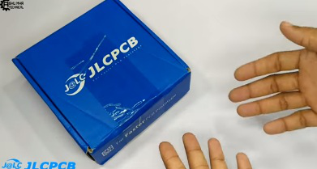

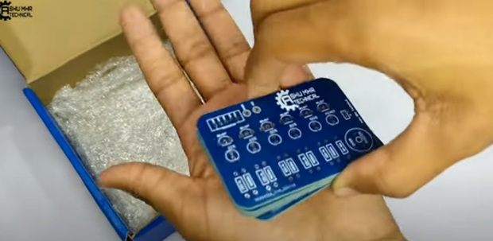

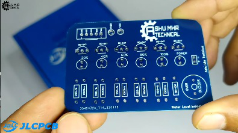

**Step 2:**

> Get all the Components listed below in images.

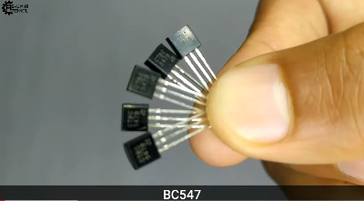

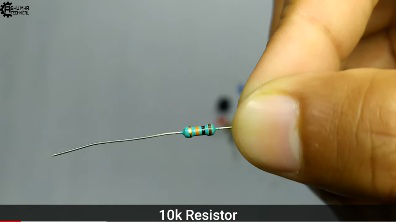

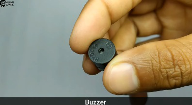

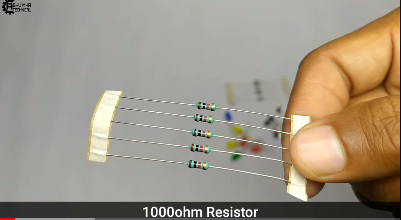

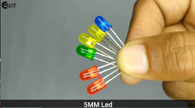

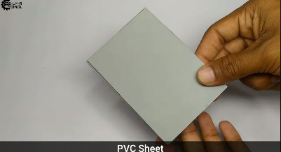

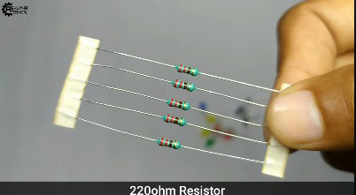

**Step 3:**

> Place all the components on PCB and solder it properly.

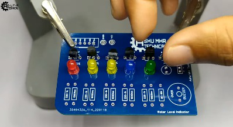

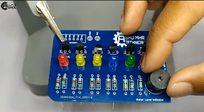

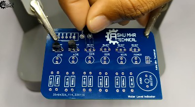

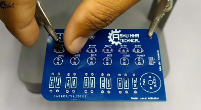

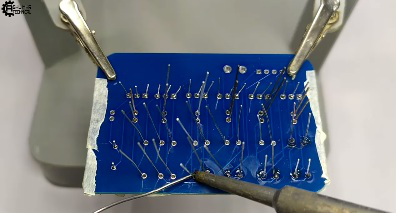

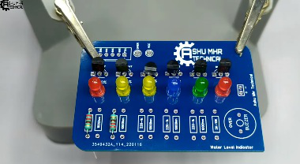

**Step 4:**

Stick the PCB in custom designed box with the help of glue gun and also
stick a 12 volt socket for power supply.

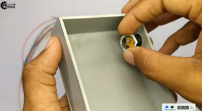

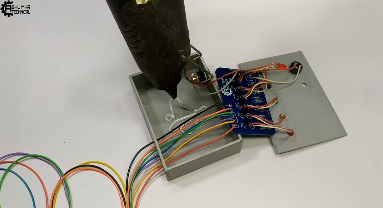

> **Step 5: Final Step**
>
> Cover the box and place all the components of PCB on their respective
> holes or places and your is now ready to use.
>
> New users will also get some coupons while registering at JCLPCB via this
> blue link.

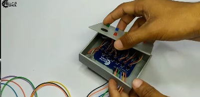

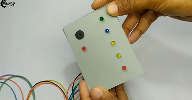

